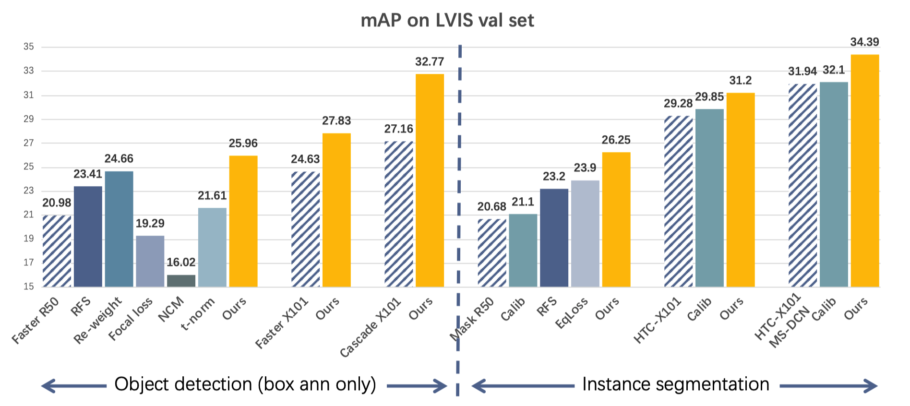

# Overcoming Classifier Imbalance for Long-tail Object Detection with Balanced Group Softmax


⚠️***Latest: Current repo is a complete version. But we delete many redundant codes and are still under testing now.***

This repo is the official implementation for CVPR 2020 oral paper: **Overcoming Classifier Imbalance for Long-tail Object Detection with Balanced Group Softmax**.
[[Paper]](http://openaccess.thecvf.com/content_CVPR_2020/papers/Li_Overcoming_Classifier_Imbalance_for_Long-Tail_Object_Detection_With_Balanced_Group_CVPR_2020_paper.pdf) 
[[Supp]](http://openaccess.thecvf.com/content_CVPR_2020/supplemental/Li_Overcoming_Classifier_Imbalance_CVPR_2020_supplemental.pdf) 
[[Slides]](https://drive.google.com/file/d/1d7kYZ2m1hlu3mw2QRTcgc2F00-Wm20qk/view?usp=sharing)
[[Video]](https://youtu.be/MRziI-6mNy8)
[[Code and models]](https://github.com/FishYuLi/BalancedGroupSoftmax)


> **Note: Current code is still not very clean yet. We are still working on it, and it will be updated soon.**


## Requirements

### 1. Environment:
The requirements are exactly the same as [mmdetection v1.0.rc0](https://github.com/open-mmlab/mmdetection/blob/v1.0rc0/INSTALL.md). We tested on on the following settings:

- python 3.7
- cuda 9.2
- pytorch 1.3.1+cu92
- torchvision 0.4.2+cu92
- mmcv 0.2.14

```setup
HH=`pwd`
conda create -n mmdet python=3.7 -y
conda activate mmdet

pip install cython
pip install numpy
pip install torch
pip install torchvision
pip install pycocotools
pip install mmcv
pip install matplotlib
pip install terminaltables

cd lvis-api/
python setup.py develop

cd $HH
python setup.py develop
```

### 2. Data:
#### a. For dataset images:

```shell=
# Make sure you are in dir BalancedGroupSoftmax

mkdir data
cd data
mkdir lvis
mkdir pretrained_models
```
    
- If you already have COCO2017 dataset, it will be great. Link `train2017` and `val2017` folders under folder `lvis`.
- If you do not have COCO2017 dataset, please download:
        [COCO train set](http://images.cocodataset.org/zips/train2017.zip) and 
        [COCO val set](http://images.cocodataset.org/zips/val2017.zip)
        and unzip these files and mv them under folder `lvis`.

#### b. For dataset annotations:
- Download lvis annotations:
        [lvis train ann](https://s3-us-west-2.amazonaws.com/dl.fbaipublicfiles.com/LVIS/lvis_v0.5_train.json.zip) and
        [lvis val ann](https://s3-us-west-2.amazonaws.com/dl.fbaipublicfiles.com/LVIS/lvis_v0.5_val.json.zip).
- Unzip all the files and put them under `lvis`, 

> To train HTC models, download [COCO stuff annotations](http://calvin.inf.ed.ac.uk/wp-content/uploads/data/cocostuffdataset/stuffthingmaps_trainval2017.zip) and change the name of folder `stuffthingmaps_trainval2017` to `stuffthingmaps`.

#### c. For pretrained models:
> Download the corresponding pre-trained models [below](#models).
- To train baseline models, we need models trained on COCO to initialize. Please download the corresponding COCO models at [mmdetection model zoo](https://github.com/open-mmlab/mmdetection/blob/v1.0rc0/MODEL_ZOO.md).
- To train balanced group softmax models (shorted as `gs` models), we need corresponding baseline models trained on LVIS to initialize and fix all parameters except for the last FC layer.
- Move these model files to `./data/pretrained_models/`

#### d. For intermediate files (**for BAGS and reweight models only**):
> You can either [donwnload](https://drive.google.com/drive/folders/1UsCscmh7F6KOya1K7R2vTT5KswsIFVXd?usp=sharing) or [generate](docs/md/generate_intermediate.md) them before training and testing. Put them under `./data/lvis/`.
- BAGS models: `label2binlabel.pt, pred_slice_with0.pt, valsplit.pkl`
- Re-weight models: `cls_weight.pt, cls_weight_bours.pt`
- RFS models: `class_to_imageid_and_inscount.pt`

**After all these operations, the folder `data` should be like this:**
```
    data
    ├── lvis
    │   ├── lvis_v0.5_train.json
    │   ├── lvis_v0.5_val.json
    │   ├── stuffthingmaps (Optional, for HTC models only)
    │   ├── label2binlabel.pt (Optional, for GAGS models only)
    │   ├── ...... (Other intermidiate files)
    │   │   ├── train2017
    │   │   │   ├── 000000004134.png
    │   │   │   ├── 000000031817.png
    │   │   │   ├── ......
    │   │   └── val2017
    │   │       ├── 000000424162.png
    │   │       ├── 000000445999.png
    │   │       ├── ......
    │   ├── train2017
    │   │   ├── 000000100582.jpg
    │   │   ├── 000000102411.jpg
    │   │   ├── ......
    │   └── val2017
    │       ├── 000000062808.jpg
    │       ├── 000000119038.jpg
    │       ├── ......
    └── pretrained_models
        ├── faster_rcnn_r50_fpn_2x_20181010-443129e1.pth
        ├── ......
```

## Training

> **Note:** Please make sure that you have prepared the [pre-trained models](#c-for-pretrained-models) and [intermediate files](#d-for-intermediate-files-for-bags-and-reweight-models-only) and they have been put to the path specified in  `${CONIFG_FILE}`. 

Use the following commands to train a model.


```train
# Single GPU
python tools/train.py ${CONFIG_FILE}

# Multi GPU distributed training
./tools/dist_train.sh ${CONFIG_FILE} ${GPU_NUM} [optional arguments]
```
All config files are under `./configs/`.
- `./configs/bags`: all models for Balanced Group Softmax.
- `./configs/baselines`: all baseline models.
- `./configs/transferred:` transferred models from long-tail image classification.
- `./configs/ablations`: models for ablation study.

For example, to train a **BAGS** model with Faster R-CNN R50-FPN:
```train
# Single GPU
python tools/train.py configs/bags/gs_faster_rcnn_r50_fpn_1x_lvis_with0_bg8.py

# Multi GPU distributed training (for 8 gpus)
./tools/dist_train.sh configs/bags/gs_faster_rcnn_r50_fpn_1x_lvis_with0_bg8.py 8
```  

> ***Important***: The default learning rate in config files is for 8 GPUs and 2 img/gpu (batch size = 8*2 = 16). According to the Linear Scaling Rule, you need to set the learning rate proportional to the batch size if you use different GPUs or images per GPU, e.g., lr=0.01 for 4 GPUs * 2 img/gpu and lr=0.08 for 16 GPUs * 4 img/gpu. (Cited from [mmdetection](https://github.com/open-mmlab/mmdetection/blob/v1.0rc0/GETTING_STARTED.md).)


## Testing

> **Note:** Please make sure that you have prepared the [intermediate files](#d-for-intermediate-files-for-bags-and-reweight-models-only) and they have been put to the path specified in `${CONIFG_FILE}`. 

Use the following commands to test a trained model. 
```test
# single gpu test
python tools/test_lvis.py \
 ${CONFIG_FILE} ${CHECKPOINT_FILE} [--out ${RESULT_FILE}] [--eval ${EVAL_METRICS}]

# multi-gpu testing
./tools/dist_test_lvis.sh \
 ${CONFIG_FILE} ${CHECKPOINT_FILE} ${GPU_NUM} [--out ${RESULT_FILE}] [--eval ${EVAL_METRICS}]
```

> - `$RESULT_FILE`: Filename of the output results in pickle format. If not specified, the results will not be saved to a file.
> - `$EVAL_METRICS`: Items to be evaluated on the results. `bbox` for bounding box evaluation only. `bbox segm` for bounding box and mask evaluation.

For example (assume that you have downloaded the corresponding model file to `./data/downloaded_models`):
- To evaluate the trained **BAGS** model with Faster R-CNN R50-FPN for object detection:
```eval
# single-gpu testing
python tools/test_lvis.py configs/bags/gs_faster_rcnn_r50_fpn_1x_lvis_with0_bg8.py \
 ./donwloaded_models/gs_faster_rcnn_r50_fpn_1x_lvis_with0_bg8.pth \
  --out gs_box_result.pkl --eval bbox

# multi-gpu testing (8 gpus)
./tools/dist_test_lvis.sh configs/bags/gs_faster_rcnn_r50_fpn_1x_lvis_with0_bg8.py \
./donwloaded_models/gs_faster_rcnn_r50_fpn_1x_lvis_with0_bg8.pth 8 \
--out gs_box_result.pkl --eval bbox
```

- To evaluate the trained **BAGS** model with Mask R-CNN R50-FPN for instance segmentation:
```eval
# single-gpu testing
python tools/test_lvis.py configs/bags/gs_mask_rcnn_r50_fpn_1x_lvis.py \
 ./donwloaded_models/gs_mask_rcnn_r50_fpn_1x_lvis.pth \
  --out gs_mask_result.pkl --eval bbox segm

# multi-gpu testing (8 gpus)
./tools/dist_test_lvis.sh configs/bags/gs_mask_rcnn_r50_fpn_1x_lvis.py \
./donwloaded_models/gs_mask_rcnn_r50_fpn_1x_lvis.pth 8 \
--out gs_mask_result.pkl --eval bbox segm
```

The evaluation results will be shown in markdown table format:
```markdown
| Type | IoU | Area | MaxDets | CatIds | Result |
| :---: | :---: | :---: | :---: | :---: | :---: |
|  (AP)  | 0.50:0.95 |    all | 300 |          all | 25.96% |
|  (AP)  | 0.50      |    all | 300 |          all | 43.58% |
|  (AP)  | 0.75      |    all | 300 |          all | 27.15% |
|  (AP)  | 0.50:0.95 |      s | 300 |          all | 20.26% |
|  (AP)  | 0.50:0.95 |      m | 300 |          all | 32.81% |
|  (AP)  | 0.50:0.95 |      l | 300 |          all | 40.10% |
|  (AP)  | 0.50:0.95 |    all | 300 |            r | 17.66% |
|  (AP)  | 0.50:0.95 |    all | 300 |            c | 25.75% |
|  (AP)  | 0.50:0.95 |    all | 300 |            f | 29.55% |
|  (AR)  | 0.50:0.95 |    all | 300 |          all | 34.76% |
|  (AR)  | 0.50:0.95 |      s | 300 |          all | 24.77% |
|  (AR)  | 0.50:0.95 |      m | 300 |          all | 41.50% |
|  (AR)  | 0.50:0.95 |      l | 300 |          all | 51.64% |
```

## Results and models
#### The main results on LVIS val set:


#### Models:

Please refer to our [paper](http://openaccess.thecvf.com/content_CVPR_2020/papers/Li_Overcoming_Classifier_Imbalance_for_Long-Tail_Object_Detection_With_Balanced_Group_CVPR_2020_paper.pdf) and [supp](http://openaccess.thecvf.com/content_CVPR_2020/supplemental/Li_Overcoming_Classifier_Imbalance_CVPR_2020_supplemental.pdf) for more details.

|   ID   | Models                       | bbox mAP / mask mAP | Train | Test |                                      Config file                                      |                                                                               Pretrained Model                                                                              | Train part |                                                Model                                               |
|:----:|------------------------------|:-------------------:|:-----:|:----:|:-------------------------------------------------------------------------------------:|:---------------------------------------------------------------------------------------------------------------------------------------------------------------------------:|:----------:|:--------------------------------------------------------------------------------------------------:|
|  (1) | Faster R50-FPN               |        20.98        |   √   |   √  |                [file](configs/baselines/faster_rcnn_r50_fpn_1x_lvis.py)               |                        [COCO R50](https://s3.ap-northeast-2.amazonaws.com/open-mmlab/mmdetection/models/faster_rcnn_r50_fpn_2x_20181010-443129e1.pth)                       |     All    | [Google drive](https://drive.google.com/file/d/1Fg2QVFbHofnexjI6lOdlGTPTFzbdDtRo/view?usp=sharing) |
|  (2) | x2                           |        21.93        |   √   |   √  |         [file](configs/transferred/faster_rcnn_r50_fpn_1x_lvis_add12epoch.py)         |                                       [Model (1)](https://drive.google.com/file/d/1Fg2QVFbHofnexjI6lOdlGTPTFzbdDtRo/view?usp=sharing)                                       |     All    | [Google drive](https://drive.google.com/file/d/1rxu5IrNj2qEEe8d5QM_vyDyP_ftd8WzI/view?usp=sharing) |
|  (3) | Finetune tail                |        22.28        |   ×   |   √  |       [file](configs/transferred/faster_rcnn_r50_fpn_1x_lvis_finetunefewshot.py)      |                                       [Model (1)](https://drive.google.com/file/d/1Fg2QVFbHofnexjI6lOdlGTPTFzbdDtRo/view?usp=sharing)                                       |     All    | [Google drive](https://drive.google.com/file/d/1B6TA8Ff2an8k4hcL5HEUahNFmBGD3ao8/view?usp=sharing) |
|  (4) | RFS                          |        23.41        |   √   |   √  |             [file](configs/transferred/faster_rcnn_r50_fpn_1x_lvis_is.py)             |                        [COCO R50](https://s3.ap-northeast-2.amazonaws.com/open-mmlab/mmdetection/models/faster_rcnn_r50_fpn_2x_20181010-443129e1.pth)                       |     All    | [Google drive](https://drive.google.com/file/d/1XIdH5CLOof4n1qFhf8CtmFuKB4DJS0bc/view?usp=sharing) |
|  (5) | RFS-finetune                 |        22.66        |   √   |   √  |         [file](configs/transferred/faster_rcnn_r50_fpn_1x_lvis_is_finetune.py)        |                                       [Model (1)](https://drive.google.com/file/d/1Fg2QVFbHofnexjI6lOdlGTPTFzbdDtRo/view?usp=sharing)                                       |     All    | [Google drive](https://drive.google.com/file/d/1Pds2CGdYvMH_TI6fc0qJ6H49XQd-QTRO/view?usp=sharing) |
|  (6) | Re-weight                    |        23.48        |   √   |   √  |         [file](configs/transferred/faster_rcnn_r50_fpn_1x_lvis_reweightall.py)        |                                       [Model (1)](https://drive.google.com/file/d/1Fg2QVFbHofnexjI6lOdlGTPTFzbdDtRo/view?usp=sharing)                                       |     All    | [Google drive](https://drive.google.com/file/d/1kluAB2tPU4FlTcnOVJk7TA4ce7ntuWWf/view?usp=sharing) |
|  (7) | Re-weight-cls                |        24.66        |   √   |   √  |     [file](configs/transferred/faster_rcnn_r50_fpn_1x_lvis_reweighthead_bours.py)     |                                       [Model (1)](https://drive.google.com/file/d/1Fg2QVFbHofnexjI6lOdlGTPTFzbdDtRo/view?usp=sharing)                                       |     Cls    | [Google drive](https://drive.google.com/file/d/1iVhBbflDHvrn6SgxEoNTDPzvb0jYms0c/view?usp=sharing) |
|  (8) | Focal loss                   |        11.12        |   ×   |   √  |        [file](configs/transferred/faster_rcnn_r50_fpn_1x_lvis_focalloss_all.py)       |                                       [Model (1)](https://drive.google.com/file/d/1Fg2QVFbHofnexjI6lOdlGTPTFzbdDtRo/view?usp=sharing)                                       |     All    | [Google drive](https://drive.google.com/file/d/1Ked5CsdN3TAD7kdHUKF0Evoi9jx4q31P/view?usp=sharing) |
|  (9) | Focal loss-cls               |        19.29        |   ×   |   √  |          [file](configs/transferred/faster_rcnn_r50_fpn_1x_lvis_focalloss.py)         |                                       [Model (1)](https://drive.google.com/file/d/1Fg2QVFbHofnexjI6lOdlGTPTFzbdDtRo/view?usp=sharing)                                       |     Cls    | [Google drive](https://drive.google.com/file/d/1MItF7t81UvQo7NAo9y7dc9jU7Z6N7gMR/view?usp=sharing) |
| (10) | NCM-fc                       |        16.02        |   ×   |   ×  |                                                                                       |                                       [Model (1)](https://drive.google.com/file/d/1Fg2QVFbHofnexjI6lOdlGTPTFzbdDtRo/view?usp=sharing)                                       |            |                                                                                                    |
| (11) | NCM-conv                     |        12.56        |   ×   |   ×  |                                                                                       |                                       [Model (1)](https://drive.google.com/file/d/1Fg2QVFbHofnexjI6lOdlGTPTFzbdDtRo/view?usp=sharing)                                       |            |                                                                                                    |
| (12) | $\tau$-norm                  |        11.01        |   ×   |   ×  |                                                                                       |                                       [Model (1)](https://drive.google.com/file/d/1Fg2QVFbHofnexjI6lOdlGTPTFzbdDtRo/view?usp=sharing)                                       |     Cls    |                                                                                                    |
| (13) | $\tau$-norm-select           |        21.61        |   ×   |   ×  |                                                                                       |                                       [Model (1)](https://drive.google.com/file/d/1Fg2QVFbHofnexjI6lOdlGTPTFzbdDtRo/view?usp=sharing)                                       |     Cls    |                                                                                                    |
| (14) | Ours (Faster R50-FPN)        |        25.96        |   √   |   √  |            [file](configs/bags/gs_faster_rcnn_r50_fpn_1x_lvis_with0_bg8.py)           |                                       [Model (1)](https://drive.google.com/file/d/1Fg2QVFbHofnexjI6lOdlGTPTFzbdDtRo/view?usp=sharing)                                       |     Cls    | [Google drive](https://drive.google.com/file/d/154kwiXwJJlP9ssVpaPpevNAiTNaE8HOq/view?usp=sharing) |
| (15) | Faster X101-64x4d            |        24.63        |   √   |   √  |            [file](configs/baselines/faster_rcnn_x101_64x4d_fpn_1x_lvis.py)            |                    [COCO x101](https://s3.ap-northeast-2.amazonaws.com/open-mmlab/mmdetection/models/faster_rcnn_x101_64x4d_fpn_1x_20181218-c9c69c8f.pth)                   |     All    | [Google drive](https://drive.google.com/file/d/1WYvNo8i2jJkmjvHR6IaT0UMLHVNbMZqF/view?usp=sharing) |
| (16) | Ours (Faster X101-64x4d)     |        27.83        |   √   |   √  |             [file](configs/bags/gs_faster_rcnn_x101_64x4d_fpn_1x_lvis.py)             |                                       [Model (15)](https://drive.google.com/file/d/1UNpNbHxnVIQTkcEQ-Jp8WaQynFhvOWT0/view?usp=sharing)                                      |     Cls    | [Google drive](https://drive.google.com/file/d/1UNpNbHxnVIQTkcEQ-Jp8WaQynFhvOWT0/view?usp=sharing) |
| (17) | Cascade X101-64x4d           |        27.16        |   √   |   √  |            [file](configs/baselines/cascade_rcnn_x101_64x4d_fpn_1x_lvis.py)           |               [COCO cascade x101](https://s3.ap-northeast-2.amazonaws.com/open-mmlab/mmdetection/models/cascade_rcnn_x101_64x4d_fpn_2x_20181218-5add321e.pth)               |     All    |                                          [Google drive]()                                          |
| (18) | Ours (Cascade X101-64x4d)    |        32.77        |   √   |   √  |             [file](configs/bags/gs_cascade_rcnn_x101_64x4d_fpn_1x_lvis.py)            |                                                                                [Model (17)]()                                                                               |     Cls    | [Google drive](https://drive.google.com/file/d/1Sxj3GwAS2bL0IGfPmsdZ40EQ5vuB3-Th/view?usp=sharing) |
| (19) | Mask R50-FPN                 |     20.78/20.68     |   √   |   √  |                 [file](configs/baselines/mask_rcnn_r50_fpn_1x_lvis.py)                |                      [COCO mask r50](https://s3.ap-northeast-2.amazonaws.com/open-mmlab/mmdetection/models/mask_rcnn_r50_fpn_2x_20181010-41d35c05.pth)                      |     All    | [Google drive](https://drive.google.com/file/d/1QiLRtnPiq7aOTFKulGSuePYnKW3-31Dy/view?usp=sharing) |
| (20) | Ours (Mask R50-FPN)          |     25.76/26.25     |   √   |   √  |                  [file](configs/bags/gs_mask_rcnn_r50_fpn_1x_lvis.py)                 |                                       [Model (19)](https://drive.google.com/file/d/1QiLRtnPiq7aOTFKulGSuePYnKW3-31Dy/view?usp=sharing)                                      |     Cls    | [Google drive](https://drive.google.com/file/d/1_yBNYpZbT3N_ebarUjwo8niLXy5KroWj/view?usp=sharing) |
| (21) | HTC X101-64x4d               |     31.28/29.28     |   √   |   √  |             [file](configs/baselines/htc_x101_64x4d_fpn_20e_16gpu_lvis.py)            |                   [COCO HTC x101](https://s3.ap-northeast-2.amazonaws.com/open-mmlab/mmdetection/models/htc/htc_x101_64x4d_fpn_20e_20190408-497f2561.pth)                   |     All    | [Google drive](https://drive.google.com/file/d/1TGAQeIAnVfgIuP7VUQDnbtV-tU640Il0/view?usp=sharing) |
| (22) | Ours (HTC X101-64x4d)        |     33.68/31.20     |   √   |   √  |              [file](configs/bags/gs_htc_x101_64x4d_fpn_20e_16gpu_lvis.py)             |                                       [Model (21)](https://drive.google.com/file/d/1TGAQeIAnVfgIuP7VUQDnbtV-tU640Il0/view?usp=sharing)                                      |     Cls    | [Google drive](https://drive.google.com/file/d/1rQuenL743EtMLzawA8LaeymTGIKj6QH0/view?usp=sharing) |
| (23) | HTC X101-64x4d-MS-DCN        |     34.61/31.94     |   √   |   √  | [file](configs/baselines/htc_dconv_c3-c5_mstrain_400_1400_x101_64x4d_fpn_20e_lvis.py) | [COCO HTC x101-ms-dcn](https://s3.ap-northeast-2.amazonaws.com/open-mmlab/mmdetection/models/htc/htc_dconv_c3-c5_mstrain_400_1400_x101_64x4d_fpn_20e_20190408-0e50669c.pth) |     All    | [Google drive](https://drive.google.com/file/d/1xkKKqZrh6ZOvxxWnaBE87It71mgS1RhK/view?usp=sharing) |
| (24) | Ours (HTC X101-64x4d-MS-DCN) |     37.71/34.39     |   √   |   √  |  [file](configs/bags/gs_htc_dconv_c3-c5_mstrain_400_1400_x101_64x4d_fpn_20e_lvis.py)  |                                       [Model (23)](https://drive.google.com/file/d/1xkKKqZrh6ZOvxxWnaBE87It71mgS1RhK/view?usp=sharing)                                      |     Cls    | [Google drive](https://drive.google.com/file/d/1QkfpYYAHgEym8KVg8a7zclSHe5LGssjH/view?usp=sharing) |
> PS: in column `Pretrained Model`, the file of `Model (n)` is the same as the `Google drive` file in column `Model` in row `(n)`.


## Citation
```citation
@inproceedings{li2020overcoming,
  title={Overcoming Classifier Imbalance for Long-Tail Object Detection With Balanced Group Softmax},
  author={Li, Yu and Wang, Tao and Kang, Bingyi and Tang, Sheng and Wang, Chunfeng and Li, Jintao and Feng, Jiashi},
  booktitle={Proceedings of the IEEE/CVF Conference on Computer Vision and Pattern Recognition},
  pages={10991--11000},
  year={2020}
}
```

## Credit
This code is largely based on [**mmdetection v1.0.rc0**](https://github.com/open-mmlab/mmdetection/tree/v1.0rc0) and [**LVIS API**](https://github.com/lvis-dataset/lvis-api).